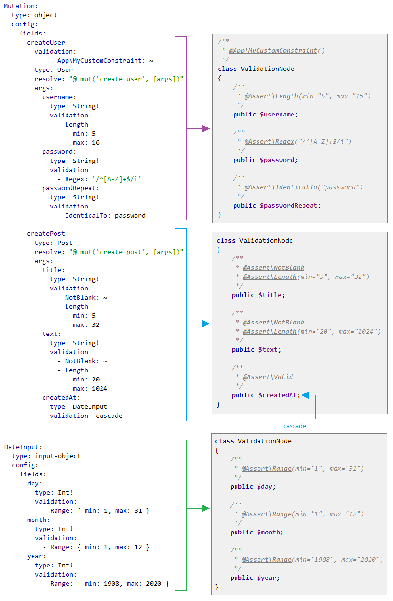
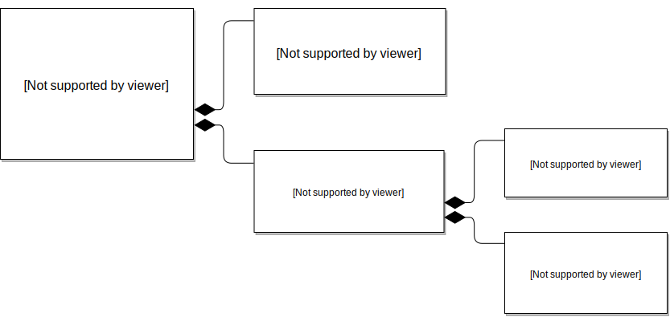

> _The validation feature was introduced in the version **0.13**_

# Validation

This bundle provides a tight integration with the [Symfony Validator Component](https://symfony.com/doc/current/components/validator.html) 
to validate user input data. It currently supports only GraphQL schemas defined with YAML.

###  Contents:
- [Overview](#overview)
- [How does it work?](#how-does-it-work)
- [Applying of validation constraints](#applying-of-validation-constraints)
    - [Listing constraints directly](#listing-constraints-directly)
        - [object](#object)
        - [input-object](#input-object)
    - [Linking to class constraints](#linking-to-class-constraints)
        - [Context of linked constraints](#context-of-linked-constraints)
        - [Validation groups of linked constraints](#validation-groups-of-linked-constraints)
    - [Cascade](#cascade)
- [Groups](#groups)
- [Group Sequences](#group-sequences)
- [Validating inside resolvers](#validating-inside-resolvers)
- [Injecting errors](#injecting-errors)
- [Error messages](#error-messages)
   - [Customizing the response](#customizing-the-response)
- [Translations](#translations)
- [Using built-in expression functions](#using-built-in-expression-functions)
- [ValidationNode API](#validationnode-api)
- [Limitations](#limitations)
    - [Annotations and GraphQL Schema language](#annotations-and-graphql-schema-language)
    - [Unsupported/Irrelevant constraints](#unsupportedirrelevant-constraints)


## Overview
In order to validate input data, the only thing you need to do is to apply [constraints](https://symfony.com/doc/current/reference/constraints.html) 
in your `yaml` type definitions (`args` by `object` types and `fields` by `input-object` types). The bundle will then 
automatically validate the data and throw an exception, which will be caught and returned in the response back to the 
client.

Follow the example below to get a quick overview of the most basic validation capabilities of this bundle. 
```yaml
# config\graphql\types\Mutation.yaml
Mutation:
    type: object
    config:
        fields:
            register:
                type: User
                resolve: "@=mutation('register', [args])"
                args:
                    username:
                        type: String!
                        validation: # applying constraints to `username`
                            - Length:
                                min: 6
                                max: 32
                    password:
                        type: String!
                        validation: # applying constraints to `password`
                            - Length:
                                min: 8
                                max: 32
                            - IdenticalTo:
                                propertyPath: passwordRepeat
                    passwordRepeat: 
                        type: String!
                    emails:
                        type: "[String]"
                        validation: # applying constraints to `emails`
                            - Unique: ~
                            - Count:
                                min: 1
                                max: 3
                            - All:
                                - Email: ~
                    birthdate:
                        type: Birthdate
                        validation: cascade # delegating validation to the embedded type
                        
Birthday:
    type: input-object
    config:
        fields:
            day:
                type: Int!
                validation:
                    - Range: { min: 1, max: 31 }
            month:
                type: Int!
                validation:
                    - Range: { min: 1, max: 12 }
            year:
                type: Int!	
                validation:
                    - Range: { min: 1900, max: 2019 }
```
The configuration above checks, that:
- **username** 
    - has length between 6 and 32
- **password** 
    - has length between 8 and 32
    - is equal to the *passwordRepeat* value
- **emails**
    - every item in the collection is unique
    - the number of items in the collection is between 1 and 3
    - every item in the collection is a valid email address

The `birthday` field is of type `input-object` and is marked as `cascade` so it's validation will happen according to the  constraints declared in the `Birthday` type:
- **day** is between 1 and 31
- **month** is between 1 and 12
- **year** is between 1900 and 2019


## How does it work?

The [Symfony Validator Component](https://symfony.com/doc/current/components/validator.html) is designed to validate 
objects. For this reason, when the validation starts, all input data is first converted into objects of class 
[`ValidationNode`](#validationnode-api) and then validated. This process is performed 
automatically by the bundle just **before** calling corresponding resolvers (each resolver gets its own `InputValidator` 
instance). If validation fails, the corresponding resolver will not be called (except when you perform
[validation inside your resolvers](#validating-inside-resolvers)).
 
> Note that the created objects are only used for validation purposes. Your resolvers will receive raw unaltered 
> arguments as usual.

Validation objects are created differently depending on the GraphQL type. Take a look at the following scheme:



As you can see, there are 2 GraphQL types: **Mutation** and **DateInput** (`object` and `input-object` respectively). In 
the case of **Mutation**, this bundle creates an object **per each field** (`createUser` and `createPost`), but in the 
case of the **DateInput**, it creates an object for the entire type. 

Keep in mind that objects are not created recursively by default. As you can see, the argument `createdAt` has its
validation set to `cascade`. It is a special value, which delegates the validation to the embedded type by doing the 
following:
 - convert the subtype (`DateInput`) into an object.
 - embed the resulting object into its parent, making it a sub-object.
 - apply to it the [`Valid`](https://symfony.com/doc/current/reference/constraints/Valid.html) constraint (for a
  recursive validation). 
 
If you don't mark embedded types as `cascade`, they will stay arrays, which can still be validated, as shown in the 
following examples.

All object properties are created dynamically and then the validation constraints are applied to them. The resulting 
object composition will be then recursively validated, starting from the root object down to it's children.

> **Note**: 
> Although it would have been possible to validate raw arguments, objects provide a better flexibility and more features.

Here is a more complex example to better demonstrate how the `InputValidator` creates objects from your GraphQL schema 
and embeds them into each other:
```yaml
Mutation:
    type: object
    config:
        fields:
            registerUser:
                type: User
                resolve: "@=mutation('registerUser', [args])"
                args:
                    username:
                        type: String!
                        validation:
                            - App\Constraint\Latin: ~
                            - Length: { min: 5, max: 16 }
                    password:
                        type: String!
                        validation:
                            - App\Constraint\Latin: ~
                            - IdenticalTo:
                                propertyPath: passwordRepeat
                    passwordRepeat:
                        type: String!
                    emails:
                        type: "[String]"
                        validation:
                            - Unique: ~
                            - Count:
                                min: 1
                                max: 3
                            - All:
                                - Email: ~
                    birthday:
                        type: Birthday
                        validation: cascade
                    job:
                        type: Job
                        validation: cascade
                    address:
                        type: Address
                        validation:
                            - Collection:
                                fields:
                                    street:
                                        - App\Constraint\Latin: ~
                                        - Length: { min: 2, max: 64 }
                                    city:
                                        - App\Constraint\Latin: ~
                                        - Length: { min: 2, max: 64 }
                                    zip:
                                        - Positive: ~
                       
Job:
    type: input-object
    config:
        fields:
            position:
                type: String!
                validation:
                    - Choice: [developer, manager, designer]
            workPeriod:
                type: Period
                validation: cascade
            address:
                type: Address
                validation: cascade

Address:
    type: input-object
    config:
        fields:
            street:
                type: String!
                validation:
                    - App\Constraint\Latin: ~
                    - Length: { min: 2, max: 64 }
            city:
                type: String!
                validation:
                    - App\Constraint\Latin: ~
                    - Length: { min: 2, max: 64 }
            zip:
                type: Int!
                validation:
                    - Positive: ~                
                    
Period:
    type: input-object
    config:
        fields:
            startDate:
                type: String!
                validation:
                    - Date: ~
            endDate:
                type: String!
                validation:
                    - Date: ~
                    - GreaterThan:
                          propertyPath: 'startDate'	

Birthday:
    type: input-object
    config:
        fields:
            day:
                type: Int!
                validation:
                    - Range: { min: 1, max: 31 }
            month:
                type: Int!
                validation:
                    - Range: { min: 1, max: 12 }
            year:
                type: Int!	
                validation:
                    - Range: { min: 1900, max: today }					
```

The configuration above would produce an object composition as shown in the UML diagram below:



> Note: The argument `address` in the object `Mutation` wasn't converted into an object, as it doesn't have the key `cascade`, but it will still be validated against the `Collection` constraint as an array.


## Applying of validation constraints

If you are familiar with Symfony Validator Сomponent, then you might know that constraints can have different 
[targets](https://symfony.com/doc/current/validation.html#constraint-targets) (class members or entire classes). Since 
all input data is represented by objects during the validation, you can also declare member constraints as well as class 
constraints.

There are 3 different methods to apply validation constraints:
- List them directly in the type definitions with the `constraints` key.
- Link to an existing class with the `link` key.
- Delegate validation to a child type (input-object) with the `cascade` key.

All 3 methods can be mixed, but if you use only 1 method you can omit the corresponding key and type config directly
under `validation`.

### Listing constraints directly
The most straightforward way to apply validation constraints is to list them under the `constraints` key. In the chapter 
[Overview](#overview) this method has already been demonstrated. Follow the examples below to see how to use
_only_ this method, as well as in combinations with [linking](#linking-to-class-constraints):

#### object:
Property constraints are applied to _arguments_:
```yaml
Mutation:
    type: object
    config:
        fields:
            updateUser:
                type: User
                resolve: "@=mutation('updateUser', [args])"
                args:
                    username:
                        type: String
                        validation: # using an explicit list of constraints (short form)
                            - NotBlank: ~ 
                            - Length:
                                min: 6
                                max: 32
                                minMessage: "Username must have {{ limit }} characters or more"
                                maxMessage: "Username must have {{ limit }} characters or less"
                            
                    email:
                        type: String
                        validation: App\Entity\User::$email # using a link (short form)
                    info:
                        type: String
                        validation: # mixing both
                            link: App\Entity\User::$info
                            constraints:
                                - NotBlank: ~
                                - App\Constraint\MyConstraint:  ~ # custom constraint
```
Class-level constraints are applied to _fields_:
```yaml
Mutation:
    type: object
    config:
        fields:
            updateUser:
                validation:
                    - Callback: [App\Validation\UserValidator, updateUser]
                type: User
                resolve: "@=mutation('updateUser', [args])"
                args:
                    username: String						
                    email: String
                    info: String	
```
It's also possible to declare validation constraints to the entire _type_. This is useful if you don't want to repeat the configuration for each field or if you want to move the entire validation logic into a function:
```yaml
Mutation:
    type: object
    config:
        validation:
            - Callback: [App\Validation\UserValidator, validate]
        fields:
            createUser:
                type: User
                resolve: "@=mutation('createUser', [args])"
                args:
                    username: String						
                    email: String
                    info: String
            updateUser:
                type: User
                resolve: "@=mutation('updateUser', [args])"
                args:
                    username: String						
                    email: String
                    info: String
            
```
which is equal to:
```yaml
Mutation:
    type: object
    config:
        fields:
            createUser:
                validation:
                    - Callback: [App\Validation\UserValidator, validate]
                type: User
                resolve: "@=mutation('createUser', [args])"
                args:
                    username: String						
                    email: String
                    info: String
            updateUser:
                validation:
                    - Callback: [App\Validation\UserValidator, validate]
                type: User
                resolve: "@=mutation('updateUser', [args])"
                args:
                    username: String						
                    email: String
                    info: String
            
```

#### input-object:

`input-object` types are designed to be used as arguments in other types. Basically, they are composite arguments, so 
the *property* constraints are declared for each _field_ unlike `object` types, where the property constraints are 
declared for each _argument_:
```yaml
User:
    type: input-object
    config:
        fields:
            username:
                type: String!
                validation: # using an explicit list of constraints
                    - NotBlank: ~
                    - Length: { min: 6, max: 32 }
            password:
                type: String!
                validation: App\Entity\User::$password # using a link
            email:
                type: String!
                validation: # mixing both
                    link: App\Entity\User::$email
                    constraints:
                        - Email: ~
```
Class-level constraints are declared 2 levels higher, under the `config` key:
```yaml
User:
    type: input-object
    config:
        validation:
            - Callback: [App\Validation\UserValidator, validate]
        fields:
            username:
                type: String!
            password:
                type: String!
            email:
                type: String!
```
### Linking to class constraints
If you already have classes (e.g. Doctrine entities) with validation constraints applied to them, you can reuse these constraints in your configuration files by linking corresponding _properties_, _getters_ or entire _classes_. What the `link` key does is simply copy all constraints of the given target without any change and apply them to an argument/field.

A `link` can have 4 different forms, each of which targets different parts of a class:
 - **property**: `<ClassName>::$<propertyName>` - the `$` symbol indicates a *single* class property.
 - **getters**:  `<ClassName>::<propertyName>()` - the parentheses indicate *all* getters of the given property name.
 - **property and getters**: `<ClassName>::<propertyName>` - the absence of the `$` and parentheses indicates a single property and all it's getters.
 - **class**: `<ClassName>` - the absence of a class member indicates an entire class.

for example:
 - **property**: `App\Entity\User::$username` - copies constraints of the property `$username` of the class `User`. 
 - **getters**:  `App\Entity\User::username()` - copies constraints of the getters `getUsername()`, `isUsername()` and `hasUsername()`.
 - **property and getters**: `App\Entity\User::username` - copies constraints of the property `$username` and it's getters `getUsername()`, `isUsername()`  and `hasUsername()`.
 - **class**: `App\Entity\User` - copies constraints applied to the entire class `User`.

> **Note**:
> If you target only getters, then prefixes must be omitted. For example, if you want to target getters of the class `User` with the names `isChild()` and `hasChildren()`, then the link would be `App\Entity\User::child()`.
> 
> Only getters with the prefix `get`, `has`, and `is` will be searched.

> **Note**:
> Linked constraints which work in a context (e.g. Expression or Callback) will NOT copy the context of the linked 
>class, but instead will work in it's own. That means that the `this` variable won't point to the linked class 
>instance, but will point to an object of the class `ValidationNode` representing your input data. See the [How does it work?](#how-does-it-work) section for more details about internal work of the validation process.

#### Example:
Suppose you have the following class:
```php
namespace App\Entity;

use Symfony\Component\Validator\Constraints as Assert;

/**
 * @Assert\Callback({"App\Validation\PostValidator", "validate"})
 */
class Post 
{
    /**
     * @Assert\NotBlank()
     */
    private $title;
    
    /**
     * @Assert\Length(max=512)
     */
    private $text;
    
    /**
     * @Assert\Length(min=5, max=10)
     */
    public function getTitle(): string
    {
        return $this->title;
    }
    
    /**
     * @Assert\EqualTo("Lorem Ipsum")
     */
    public function hasTitle(): bool
    {
        return strlen($this->title) !== 0;
    }
    
    /**
     * @Assert\Json()
     */
    public function getText(): string
    {
        return $this->text;
    }
}
```
Then you could link class members this way:
```yaml
Mutation:
    type: object
        config:
            fields:
                editPost:
                    type: Post
                    resolve: "@=mutation('edit_post', [args])"
                    validation:
                        link: App\Entity\Post # targeting the class
                    args:
                        title:
                            type: String!
                            validation:
                                link: App\Entity\Post::title # property and getters
                        text:
                            type: String!
                            validation:
                                link: App\Entity\Post::$text # only property
```
or use the short form (omitting the `link` key), which is equal to the config above:
```yaml
 # ...
                    validation: App\Entity\Post # targeting the class
                    args:
                        title:
                            type: String!
                            validation: App\Entity\Post::title # property and getters
                        text:
                            type: String!
                            validation: App\Entity\Post::$text # only property
 # ...
```
The argument `title` will get 3 assertions: `NotBlank()`, `Length(min=5, max=10)` and `EqualTo("Lorem Ipsum")`, whereas 
the argument `text` will only get `Length(max=512)`. The method `validate` of the class `PostValidator` will also be 
called once, given an object representing the input data.

#### Context of linked constraints

When linking constraints, keep in mind that the validation context won't be inherited (copied). For example, suppose you 
have the following Doctrine entity:

```php
namespace App\Entity;

/**
 * @Assert\Callback("validate")
 */
class User 
{
    public static function validate() 
    {
        // ...
    }
}
```
and this config:
```yaml
Mutation:
    type: object
    config:
        fields:
            createUser:
                validation: App\Entity\User # linking
                resolve: "@=res('createUser', [args])"
                # ...
```
Now, when you try to validate the arguments in your resolver, it will throw an exception, because it will try to call a 
method with the name `validate` on the object of class `ValidationNode`, which doesn't have such. As explained in the 
section [How does it work?](#how-does-it-work) all input data is represented objects of class `ValidationNode` during 
the validation process.

####  Validation groups of linked constraints

Linked constraints will be used _as it is_. This means that it's not possible to change any of their params including 
_groups_. For example, if you link a _property_ on class `User`, then all copied constraints will be in the groups 
`Default` and `User` (unless other groups declared explicitly in the linked class itself).


### Cascade

The validation of arguments of the type `input-object`, which are marked as `cascade`, will be delegated to the embedded 
type. The nesting can be any depth.

#### Example:
```yaml
Mutation:
    type: object
        config:
            fields:
                updateUser:
                    type: Post
                    resolve: "@=mutation('update_user', [args])"
                    args:
                        id: 
                            type: ID!
                        address:
                            type: AddressInput
                            validation: cascade # delegate to AddressInput
                        workPeriod:
                            type: PeriodInput
                            validation: cascade # delegate to PeriodInput

AddressInput:
    type: input-object
    config:
        fields:
            street:
                type: String!
                validation:
                    - Length: { min: 5, max: 15 }
            city:
                type: String!
                validation:
                    - Choice: ['Berlin', 'New York', 'Moscow']
            house:
                type: Int!
                validation:
                    - Positive: ~

PeriodInput:
    type: input-object
    config:
        fields:
            startDate:
                type: String!
                validation:
                    - Date: ~
            endDate:
                type: String!
                validation:
                    - Date: ~
                    - GreaterThan:
                          propertyPath: 'startDate'
```

## Groups

It is possible to organize constraints into [validation groups](https://symfony.com/doc/current/validation/groups.html). 
By default, if you don't declare groups explicitly, every constraint of your type will be in 2 groups: **Default** and 
the name of the type. For example, if the type's name is **Mutation** and the declaration of constraint is `NotBlank: ~`
 (no explicit groups declared), then it automatically falls into 2 default groups: **Default** and **Mutation**. These 
 default groups will be removed, if you declare groups explicitly. Follow the 
 [link](https://symfony.com/doc/current/validation/groups.html) for more details about validation groups in the Symfony 
 Validator Component.

Validation groups could be useful if you use a same `input-object` type in different contexts and want it to be 
validated differently (with different groups). Take a look at the following example:
```yaml
Mutation:
    type: object
    config:
        fields:
            registerUser: 
                type: User
                resolve: "@=('register_user')"
                validationGroups: ['User']
                args:
                    input:
                        type: UserInput!
                        validation: cascade
            registerAdmin: 
                type: User
                resolve: "@=('register_admin')"
                validationGroups: ['Admin']
                args:
                    input:
                        type: UserInput!
                        validation: cascade

UserInput:
    type: input-object
    config:
        fields:
            username:
                type: String!
                validation:
                    - Length: {min: 3, max: 15}
            password:
                type: String
                validation:
                    - Length: {min: 4, max: 32, groups: 'User'}
                    - Length: {min: 10, max: 32, groups: 'Admin'}
```
As you can see the `password` field of the `UserInput` type has a same constraint applied to it twice, but with 
different groups. The `validationGroups` option ensures that validation will only use the constraints that are listed 
in it.

In case you inject the validator into the resolver (as described [here](#validating-inside-resolvers)), the `validationGroups`
option will be ignored. Instead you should pass groups directly to the injected validator. This approach could be 
necessary in some few cases.

Let's take the example from the chapter [Overview](#overview) and edit the configuration to inject the `validator` and 
to use validation groups:
```yaml
# config\graphql\types\Mutation.yaml
Mutation:
    type: object
    config:
        fields:
            register:
                type: User
                resolve: "@=mut('register', [args, validator])" # injecting validator
                args:
                    username:
                        type: String!
                        validation:
                            - Length:
                                min: 6
                                max: 32
                                groups: ['registration']
                    password:
                        type: String!
                        validation:
                            - Length:
                                min: 8
                                max: 32
                            - IdenticalTo:
                                propertyPath: passwordRepeat
                                groups: ['registration']
                    passwordRepeat: 
                        type: String!
                    emails:
                        type: "[String]"
                        validation:
                            - Unique: ~
                            - Count:
                                min: 1
                                max: 3
                            - All:
                                - Email: ~
                    birthday:
                        type: Birthday
                        validation: cascade
                         
Birthday:
    type: input-object
    config:
        fields:
            day:
                type: Int!
                validation:
                    - Range: { min: 1, max: 31 }
            month:
                type: Int!
                validation:
                    - Range: { min: 1, max: 12 }
            year:
                type: Int!	
                validation:
                    - Range: { min: 1900, max: today }
```
Here we injected the `validator` variable into the `register` resolver. By doing so we are turning the automatic 
validation off to perform it inside the resolver (see [Validating inside resolvers](#validating-inside-resolvers)). The 
injected instance of the `InputValidator` class could be used in a resolver as follows:
```php
namespace App\GraphQL\Mutation\Mutation

use Overblog\GraphQLBundle\Definition\Argument;
use Overblog\GraphQLBundle\Definition\Resolver\AliasedInterface;
use Overblog\GraphQLBundle\Definition\Resolver\MutationInterface;
use Overblog\GraphQLBundle\Validator\InputValidator;

class UserResolver implements MutationInterface, AliasedInterface
{

    public function register(Argument $args, InputValidator $validator)
    {
        /* 
         * Validates:
         *   - username against 'Length'
         *   - password againt 'IdenticalTo'
         */
        $validator->validate('registration');
    
        /* 
         * Validates:
         *   - password against 'Length'
         *   - emails against 'Unique', 'Count' and 'All'
         *   - birthday against 'Valid' (cascade).
         *       - day against 'Range'
         *       - month against 'Range'
         *       - year against 'Range'
         */ 
        $validator->validate('Default');
        // ... which is in this case equal to:
        $validator->validate(); 
    
        /** 
         * Validates only arguments in the 'Birthday' type 
         * against constraints with no explicit groups.
         */
        $validator->validate('Birthdate');	
    
        // Validates all arguments in each type against all constraints.
        $validator->validate(['registration', 'Default']);
        // ... which is in this case equal to:
        $validator->validate(['registration', 'Mutation', 'Birthdate']);
    }

    public static function getAliases(): array
    {
        return ['register' => 'register'];
    }	
}
```
> **Note**:
> All arguments marked for cascade validation will be automatically validated against the [Valid](https://symfony.com/doc/current/reference/constraints/Valid.html) constraint.

## Group Sequences
You can use `GroupSequence` constraint to sequentially apply validation groups. See the [official documentation](https://symfony.com/doc/current/validation/sequence_provider.html) for more details.

Applying group sequences is similar to _normal_ constraints:
```yaml
Mutation:
    type: object
    config:
        validation:
            - GroupSequence: ['group1', 'group2']
        fields:
            create:
                # ...
            update:
                # ...
```
or for each field:
```yaml
Mutation:
    type: object
    config:
        fields:
            create:
                validation:
                    - GroupSequence: ['group1', 'group2']
                # ...
            update:
                validation:
                    - GroupSequence: ['group3', 'group4']
                # ...
```

## Validating inside resolvers
You can turn the auto-validation off by injecting the validator into your resolver. This can be useful if you want to 
do something before the actual validation happens or customize other aspects, for example validate data multiple times 
with different groups or make the validation conditional.

Here is how you can inject the validator:
```yaml
Mutation:
    type: object
    config:
        fields:
            register:
                resolve: "@=mutation('register', [args, validator])"
                # ...
```
resolver:
```php
namespace App\GraphQL\Mutation\Mutation

use Overblog\GraphQLBundle\Definition\Argument;
use Overblog\GraphQLBundle\Definition\Resolver\AliasedInterface;
use Overblog\GraphQLBundle\Definition\Resolver\MutationInterface;
use Overblog\GraphQLBundle\Validator\InputValidator;

class UserResolver implements MutationInterface, AliasedInterface
{
    public function register(Argument $args, InputValidator $validator): User
    {
        // This line executes a validation process and throws ArgumentsValidationException 
        // on fail. The client will then get a well formatted error message.
        $validator->validate();

        // To validate with groups just pass a string or an array
        $validator->validate(['my_group', 'group2']);

        // Or use a short syntax, which is equal to $validator->validate().
        // This is possible thanks to the __invoke magic method.
        $validator();
        
        // The code below won't be reached if one of the validations above fails
        $user = $this->userManager->createUser($args);
        $this->userManager->save($user);
        
        return $user;
    }

    public static function getAliases(): array
    {
        return ['register' => 'register'];
    }	
}
```
If you want to prevent the validator to automatically throw an exception just pass `false` as the second argument. It 
will return an instance of the `ConstraintViolationList` class instead:
```php
$errors = $validator->validate('my_group', false);

// Do something with errors
if ($errors->count() > 0) {
    // ...
}
```

## Injecting `errors`
It's possible to inject the `errors` variable with all validation violations instead of automatic exception throw:
```yaml
Mutation:
    type: object
    config:
        fields:
            register:
                resolve: "@=mutation('register', [args, errors])"
                # ...
```
```php
namespace App\GraphQL\Mutation\Mutation

use Overblog\GraphQLBundle\Definition\Argument;
use Overblog\GraphQLBundle\Definition\Resolver\AliasedInterface;
use Overblog\GraphQLBundle\Definition\Resolver\MutationInterface;
use Overblog\GraphQLBundle\Error\ResolveErrors;

class UserResolver implements MutationInterface, AliasedInterface
{
    public function register(Argument $args, ResolveErrors $errors): User
    {
        $violations = $errors->getValidationErrors();
        
        // ...
    }

    public static function getAliases(): array
    {
        return ['register' => 'register'];
    }	
}
```

## Error Messages
By default the `InputValidator` throws an `ArgumentsValidationException`, which will be caught and serialized into 
a readable response. The [GraphQL specification](https://graphql.github.io/graphql-spec/June2018/#sec-Errors) defines a 
certain shape of all errors returned in the response. According to it all validation violations are to be found under
the path `errors[index].extensions.validation` of the response object. 

Example of a response with validation errors:

```json
{
  "data": null,
  "errors": [{
    "message": "validation",
    "extensions": {
      "category": "arguments_validation_error",
      "validation": {
        "username": [
          {
            "message": "This value should be equal to 'Lorem Ipsum'.", 
            "code": "478618a7-95ba-473d-9101-cabd45e49115"
          }
        ],
        "email": [
          {
            "message": "This value is not a valid email address.", 
            "code": "bd79c0ab-ddba-46cc-a703-a7a4b08de310"
          },
          {
            "message": "This value is too short. It should have 5 character or more.", 
            "code": "9ff3fdc4-b214-49db-8718-39c315e33d45"
          }
        ]
      }
    },
    "locations": [
      {"line": 3, "column": 17}
    ],
    "path": ["linkedConstraintsValidation"]
  }]
}
```

The codes in the response could be used to perform a client-side translation of the validation violations.

### Customizing the response
You can customize the output by passing `false` as a second argument to the `validate` method. 
This will prevent an exception to be thrown and a `ConstraintViolationList` object will be returned instead:

```php
public function resolver(InputValidator $validator) 
{
    $errors = $validator->validate(null, false);
    
    // Use $errors to build your own exception
    ...
}
```
See more about [Error handling](https://github.com/overblog/GraphQLBundle/blob/master/docs/error-handling/index.md).

## Translations

All validation violations are automatically translated from the `validators` domain. 

Example:
```yaml
Mutation:
    type: object
    config:
        fields:
            register:
                type: User
                resolve: "@=mutation('register', [args])"
                args:
                    username:
                        type: String!
                        validation:
                            - Length:
                                min: 6
                                max: 32
                                minMessage: "register.username.length.min"
                                maxMessage: "register.username.length.max"
                    password:
                        type: String!
                        validation:
                            - Length: 
                                min: 8
                                max: 32
                                minMessage: "register.password.length.min"
                                maxMessage: "register.password.length.max"
                            - IdenticalTo:
                                propertyPath: passwordRepeat
                                message: "register.password.identical"
                    passwordRepeat: 
                        type: String!
```

Create a translation resource for the `validators` [domain](https://symfony.com/doc/current/components/translation.html#using-message-domains):
```yaml
# translations\validators.en.yaml
register.username.length.min: "The username should have {{ length }} characters or more"
register.username.length.max: "The username should have {{ length }} characters or less"
register.password.length.min: "The password should have {{ length }} characters or more"
register.password:length.max: "The password should have {{ length }} characters or less"
register.password.identical: "The passwords are not equal."
```
or use another format, which is more readable:
```yaml
# translations\validators.en.yaml
register:
    username:
        length:
            min: "The username should have {{ length }} characters or more"
            max: "The username should have {{ length }} characters or less"
    password:
        identical: "The passwords are not equal."
        length:
            min: "The password should have {{ length }} characters or more"
            max: "The password should have {{ length }} characters or less"
```
To translate into other languages just create additional  translation resource with a required suffix, for example `validators.de.yaml` for German and `validators.ru.yaml` for Russian.

## Using built-in expression functions

This bundle comes with built-in [ExpressionLanguage](#https://symfony.com/doc/current/components/expression_language.html) 
instance and pre-registered [expression functions and variables](https://github.com/overblog/GraphQLBundle/blob/master/docs/definitions/expression-language.md). 
By default the  [`Expression`](https://symfony.com/doc/current/reference/constraints/Expression.html) 
constraint in your project has no access to these functions and variables, because it uses the default instance of the 
`ExpressionLanguage` class. In order to _tell_ the `Expression` constraint to use the instance of this bundle, you need
to rewrite its service declaration. Add the following config to the `services.yaml`:

```yaml
validator.expression:  
    class: Overblog\GraphQLBundle\Validator\Constraints\ExpressionValidator  
    arguments: ['@Overblog\GraphQLBundle\ExpressionLanguage\ExpressionLanguage'] 
    tags:  
        - name: validator.constraint_validator  
          alias: validator.expression
```

This will make possible to use all functions, registered in this bundle:
```yaml
# ...
args:
    username:
        type: String!
        validation:
            - Expression: "service('my_service').entityExists(value)"
```
as well as variables from the resolver context (`value`, `args`, `context` and `info`):
```yaml
# ...
args:
    username:
        type: String!
        validation:
            - Expression: "service('my_service').isValid(value, args, info, context, parentValue)"
```
> **Note**:
>
> Expressions in the `Expression` constraint should NOT be prefixed with `@=`.
> As you might know, the `Expression` constraint has one built-in variable called [`value`](https://symfony.com/doc/current/reference/constraints/Expression.html#message). 
>In order to avoid name conflicts, the resolver variable `value` is renamed to `parentValue`, when using in the 
>`Expression` constraint.
>
> In short: the `value` represents currently validated input data, and `parentValue` represents the data returned by the parent resolver.


## ValidationNode API

The ValidationNode class is used internally during the validation process. See the [How does it work?](#how-does-it-work) section for more details.

This class has methods that may be useful when using such constraints as `Callback` or `Expression`, which work in a context.

### Methods
<code><b>getType</b>(): GraphQL\Type\Definition\Type</code>  
&nbsp;&nbsp;Returns the `Type` object associated with current validation node.

<code><b>getName</b>(): string</code>  
&nbsp;&nbsp;Returns the name of the associated Type object. Shorthand for `getType()->name`.

<code><b>getFieldName</b>(): string|null</code>   
&nbsp;&nbsp;Returns the field name if the object is associated with an `object` type, otherwise returns `null`   

<code><b>getParent</b>(): ValidationNode|null</code>   
&nbsp;&nbsp;Returns the parent node.

<code><b>findParent</b>(string <b>$name</b>): ValidationNode|null</code>   
&nbsp;&nbsp;Traverses up through parent nodes and returns first object with matching name.

### Examples

#### Usage in the `Expression` constraints: 
In this example we are checking if the value of the field `shownEmail` is contained in the `emails` array. We are using the method `getParent()` to access a field of the type `Mutation` from within the type `Profile`:
```yaml
Mutation:
    type: object
    config:
        fields:
            registerUser:
                type: User
                resolve: "@=resolver('register_user', [args])"
                args:
                    username: String!
                    password: String!
                    passwordRepeat: String!
                    emails:
                        type: "[String]"
                        validation:
                            - Unique: ~
                            - Count:
                                min: 1
                                max: 5
                            - All:
                                - Email: ~
                    profile:
                        type: Profile
                        validation: cascade
                    
Profile:
    type: input-object
    config:
        fields:
            shownEmail:
                type: String!
                validation:
                    - Expression: "value in this.getParent().emails"
            # ...
```

#### Usage with `Callback` constraints:
In this example we are applying a same validation constraint to both `createUser` and `createAdmin` resolvers.
```yaml
Mutation:
    type: object
    config:
        validation:
            - Callback: [App\Validation\Validator, validate]
        fields:
            createUser:
                type: User
                resolve: "@=resolver('createUser', [args])"
                args:
                    username: String!
                    password: String!
                    passwordRepeat: String!
                    email: String!
            createAdmin:
                type: User
                resolve: "@=resolver('createAdmin', [args])"
                args:
                    username: String!
                    password: String!
                    passwordRepeat: String!
                    email: String!
```

To find out which of 2 fields is being validated inside the method, we can use method `getFieldName`:
```php
namespace App\Validation;  

use Overblog\GraphQLBundle\Validator\ValidationNode;

// ...

    public static function validate(ValidationNode $object, ExecutionContextInterface $context, $payload): void
    {  
        switch ($object->getFieldName()) {  
            case 'createUser':  
                // Validation logic for users  
                break;  
            case 'createAdmin':  
                // Validation logic for admins  
                break;  
            default:  
                // Validation logic for all other fields 
        }  
    }

// ...
```

## Limitations

### Annotations and GraphQL Schema language

The current implementation of `InputValidator` works only for schema types declared in yaml files. Types declared with [annotations](https://github.com/overblog/GraphQLBundle/blob/master/docs/annotations/index.md) or with [GraphQL schema language](https://github.com/overblog/GraphQLBundle/blob/master/docs/definitions/graphql-schema-language.md) are not supported. This can be changed in the future versions.

The annotations system of this bundle has its own limited validation implementation, see the [Arguments Transformer](https://github.com/overblog/GraphQLBundle/blob/master/docs/annotations/arguments-transformer.md) section for more details.

### Unsupported/Irrelevant constraints
These are the validation constraints, which are not currently supported or have no effect to the validation:
- [File](https://symfony.com/doc/current/reference/constraints/File.html) - not supported (_under development_)
- [Image](https://symfony.com/doc/current/reference/constraints/Image.html) - not supported (_under development_)
- [UniqueEntity](https://symfony.com/doc/current/reference/constraints/UniqueEntity.html)
- [Traverse](https://symfony.com/doc/current/reference/constraints/Traverse.html) - although you can use this constraint, 
it would make no sense, as nested objects will be automatically validated with the `Valid` 
constraint. See [How does it work?](#how-does-it-work) section to get familiar with the internals.
