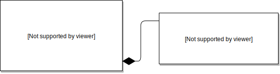
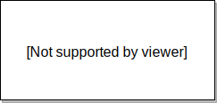

# Validation

This bundle provides a tight integration with the [Symfony Validator Component](https://symfony.com/doc/current/components/validator.html) to validate user input data.

###  Contents:
- [Overview](#overview)
- [How does it work?](#how-does-it-work)
- [Applying validation constraints](#applying-validation-constraints)
    - [Listing constraints explicitly](#listing-constraints-explicitly)
        - [object](#object)
        - [input-object](#input-object)
    - [Linking class constraints](#linking-class-constraints)
        - [Context of linked constraints](#context-of-linked-constraints)
        - [Validation groups of linked constraints](#validation-groups-of-linked-constraints)
    - [Cascade](#cascade)
- [Groups](#groups)
- [Group Sequences](#group-sequences)
- [Customize error messages](#customize-error-messages)
- [Translations](#translations)
- [Using build in expression functions](#using-built-in-expression-functions)
- [ValidationNode API](#validationnode-api)
- [Limitations](#limitations)
    - [Annotations and GraphQL Schema language](#annotations-and-graphql-schema-language)
    - [Unsupported constraints](#unsupported-constraints)


## Overview
Follow the example below to get a quick overview of the basic validation capabilities of this bundle. 
```yaml
# config\graphql\types\Mutation.yaml
Mutation:
    type: object
    config:
        fields:
            register:
                type: User
                resolve: "@=mutation('register', [args, validator])"
                args:
                    username:
                        type: String!
                        validation:
                            - Length:
                                min: 6
                                max: 32
                     password:
                        type: String!
                        validation:
                            - Length:
                                min: 8
                                max: 32
                            - IdenticalTo:
                                propertyPath: passwordRepeat
                    passwordRepeat: 
                        type: String!
                    emails:
                        type: "[String]"
                        validation:
                            - Unique: ~
                            - Count:
                                min: 1
                                max: 3
                            - All:
                                - Email: ~
                    birthdate:
                        type: Birthdate
                        validation: cascade
                        
Birthday:
    type: input-object
    config:
        fields:
            day:
                type: Int!
                validation:
                    - Range: { min: 1, max: 31 }
            month:
                type: Int!
                validation:
                    - Range: { min: 1, max: 12 }
            year:
                type: Int!	
                validation:
                    - Range: { min: 1900, max: today }
```
The configuration above ensures, that:
- **username** 
    - has length between 6 and 32
- **password** 
    - has length between 8 and 32
    - is equal to the *passwordRepeat* value
- **email**
    - every item in the collection is unique
    - the number of items in the collection is between 1 and 3
    - every item in the collection is a valid email address

The `birthday` field is of type `input-object` and marked as `cascade` so it's validation will happen according to the  constraints declared in the `Birthday` type:
- **day** is between 1 and 31
- **month** is between 1 and 12
- **year** is between 1900 and today


A configured `validator` will be then injected into the resolver defined in the `Mutation.yaml`:
```php
namespace App\GraphQL\Mutation\Mutation

use Overblog\GraphQLBundle\Definition\Argument;
use Overblog\GraphQLBundle\Definition\Resolver\AliasedInterface;
use Overblog\GraphQLBundle\Definition\Resolver\MutationInterface;
use Overblog\GraphQLBundle\Validator\InputValidator;

class UserResolver implements MutationInterface, AliasedInterface
{
    public function register(Argument $args, InputValidator $validator): User
    {
        // This line executes a validation process and throws MutationValidationException 
        // on fail. The client will then get a well formatted error message.
        $validator->validate();
        
        // This line wont be reached if the validation fails
        $user = $this->userManager->createUser($args);
        $this->userManager->save($user);
        
        return $user;
    }

    public static function getAliases(): array
    {
        return ['register' => 'register'];
    }	
}
```
## How does it work?

The Symfony Validator Component is designed to validate objects. For this reason the `validator` of this bundle creates  temporary objects from your GraphQL types during the validation process and populates them with the input data. The object properties are created dynamically in runtime with the same names as the corresponding `args` or `fields`, depending on GraphQL type (`object` and `input-object` respectively). All newly created objects will be instances of the class `ValidationNode`. See the [ValidationNode API](#validationnode-api) for more details about this class.

Any arguments of the type `input-object` marked for [cascade](#cascade) validation will also be converted to objects of class `ValidationNode` and embedded in the parent object. The resulting object composition will be then recursively validated, starting from the root object down to the children.

Let's take the example from the chapter [Overview](#overview). When you call `$validator->validate()` in the `register` resolver, the following objects will be created:



Notice, that the `birthday` argument is converted to an object, as it was marked for cascade validation.

Here is a complex example to better demonstrate the internal work of the `InputValidator`:
```yaml
# config\graphql\types\Mutation.yaml
Mutation:
    type: object
    config:
        fields:
            registerUser:
                type: User
                resolve: "@=mutation('registerUser', [args, validator])"
                args:
                    username:
                        type: String!
                        validation:
                            - App\Constraint\Latin: ~
                            - Length: { min: 5, max: 16 }
                    password:
                        type: String!
                        validation:
                            - App\Constraint\Latin: ~
                            - IdenticalTo:
                                propertyPath: passwordRepeat
                    passwordRepeat:
                        type: String!
                    emails:
                        type: "[String]"
                        validation:
                            - Unique: ~
                            - Count:
                                min: 1
                                max: 3
                            - All:
                                - Email: ~
                    birthday:
                        type: Birthday
                        validation: cascade
                    job:
                        type: Job
                        validation: cascade
                    address:
                        type: Address
                        validation:
                            - Collection:
                                fields:
                                    street:
                                        - App\Constraint\Latin: ~
                                        - Length: { min: 2, max: 64 }
                                    city:
                                        - App\Constraint\Latin: ~
                                        - Length: { min: 2, max: 64 }
                                    zip:
                                        - Positive: ~
            registerAdmin:
                type: User
                resolve: "@=mutation('registerAdmin', [args, validator])"
                args:
                    username:
                        type: String!
                        validation:
                            - Length: { min: 8 }
                    password:
                        type: String!
                        validation:
                            - Length: { min: 10 }
                            - IdenticalTo:
                                propertyPath: passwordRepeat
                    passwordRepeat:
                        type: String!
                       
Job:
    type: input-object
    config:
        fields:
            position:
                type: String!
                validation:
                    - Choice: [developer, manager, designer]
            workPeriod:
                type: Period
                validation: cascade
            address:
                type: Address
                validation: cascade

Address:
    type: input-object
    config:
        fields:
            street:
                type: String!
                validation:
                    - App\Constraint\Latin: ~
                    - Length: { min: 2, max: 64 }
            city:
                type: String!
                validation:
                    - App\Constraint\Latin: ~
                    - Length: { min: 2, max: 64 }
            zip:
                type: Int!
                validation:
                    - Positive: ~                
                    
Period:
    type: input-object
    config:
        fields:
            startDate:
                type: String!
                validation:
                    - Date: ~
            endDate:
                type: String!
                validation:
                    - Date: ~
                    - GreaterThan:
                          propertyPath: 'startDate'	

Birthday:
    type: input-object
    config:
        fields:
            day:
                type: Int!
                validation:
                    - Range: { min: 1, max: 31 }
            month:
                type: Int!
                validation:
                    - Range: { min: 1, max: 12 }
            year:
                type: Int!	
                validation:
                    - Range: { min: 1900, max: today }					
```


The configuration above would produce object compositions as shown in the UML diagrams below:

for the `registerUser` resolver:


> Note that the argument `address` in the object `Mutation` wasn't converted to an object of class `ValidationNode`, as it wasn't marked as `cascade`, but it will still be validated against the `Collection` constraint.

for the `registerAdmin` resolver:



## Applying validation constraints

If you are familiar with Symfony Validator Сomponent, then you might know that constraints can have different [targets](https://symfony.com/doc/current/validation.html#constraint-targets) (class members or entire classes). This bundle provides the same technique in which you could declare property constraints as well as class constraints.

Constraints can be listed directly in the type configurations or can be mapped from existent classes (e.g. Doctrine entities) with the `link` key. See [Linking to classes](#linking-to-classes) section for more details.

Constraints can be applied to `object` and `input-object` types.

### Listing constraints explicitly
The most straightforward way to apply validation constraints to input data is to list them under the `constraints` key.
In the chapter [Overview](#overview) this method was already demonstrated. Follow the examples below to see how to use
_only_ this method as well as in combinations with [linking](#linking-class-constraints):

#### object:
Property constraints are applied to _arguments_:
```yaml
Mutation:
    type: object
    config:
        fields:
            updateUser:
                type: User
                resolve: "@=mutation('updateUser', [args, validator])"
                args:
                    username:
                        type: String
                        validation: # using an explicit list of constraints
                            - NotBlank: ~ 
                            - Length:
                                min: 6
                                max: 32
                                minMessage: "Username must have {{ limit }} characters or more"
                                maxMessage: "Username must have {{ limit }} characters or less"
                            
                    email:
                        type: String
                        validation: App\Entity\User::$email # using a link
                    info:
                        type: String
                        validation: # mixing both
                            link: App\Entity\User::$info
                            constraints:
                                - NotBlank: ~
                                - App\Constraint\MyConstraint:  ~ # custom constraint
```
Class constraints are applied on the _field_ level:
```yaml
Mutation:
    type: object
    config:
        fields:
            updateUser:
                type: User
                resolve: "@=mutation('updateUser', [args, validator])"
                validation:
                    - Callback: [App\Validation\UserValidator, updateUser]
                args:
                    username: String						
                    email: String
                    info: String	
```
It's also possible to declare validation constraint on the _type_ level. This is useful if you don't want to repeat the configuration for each field or if you want to move the entire validation logic into a function:
```yaml
Mutation:
    type: object
    config:
        validation:
            - Callback: [App\Validation\UserValidator, validate]
        fields:
            createUser:
                type: User
                resolve: "@=mutation('createUser', [args, validator])"
                args:
                    username: String						
                    email: String
                    info: String
            updateUser:
                type: User
                resolve: "@=mutation('updateUser', [args, validator])"
                args:
                    username: String						
                    email: String
                    info: String
            
```
#### input-object:

`input-object` types are designed to be used as arguments in other types. Basically they are composite arguments, so the property constraints are declared for each _field_ unlike `object` types, where the property constraints are declared for each _argument_:
```yaml
User:
    type: input-object
    config:
        fields:
            username:
                type: String!
                validation: # using an explicit list of constraints
                    - NotBlank: ~
                    - Length: { min: 6, max: 32 }
            password:
                type: String!
                validation: App\Entity\User::$password # using a link
            email:
                type: String!
                validation: # mixing both
                    link: App\Entity\User::$email
                    constraints:
                        - Email: ~
```
class constraints are declared a level higher, under the `config` key:
```yaml
User:
    type: input-object
    config:
        validation:
            - Callback: [App\Validation\UserValidator, validate]
        fields:
            username:
                type: String!
            password:
                type: String!
            email:
                type: String!
```
### Linking class constraints
If you already have classes (e.g. Doctrine entities) with validation constraints applied to them, you can reuse these constraints in your configuration files by linking corresponding _properties_, _getters_ or entire _classes_.

A `link` can have 4 different targets:
 - **property**: `<ClassName>::$<propertyName>`
 - **getters**:  `<ClassName>::<propertyName>()`
 - **property and getters**: `<ClassName>::<propertyName>`
 - **class**: `<ClassName>`

for example:
 - **property**: `App\Entity\User::$username` links to a single property `$username` of the class `User`. 
 - **getters**:  `App\Entity\User::username()` links to `getUsername()`, `isUsername()` and `hasUsername()`.
 - **property and getters**: `App\Entity\User::username` links to a single property `$username` as well to `getUsername()`, `isUsername()`  and `hasUsername()`
 - **class**: `App\Entity\User` links to

> **Note**:
> If you target only getters, then prefixes must be omitted. For example, if you want to target getters of the class `User` with the names `isChild()` and `hasChildren()`, then the link would be `App\Entity\User::child()`.
> 
> Only getters with the prefix `get`, `has`, and `is` will be searched.

> **Note**:
> Linked constraints which work in a context (e.g. Expression or Callback) will NOT take the context of the linked class, but instead will work in it's own. That means that the `$this` variable won't point to the linked class instance, but will point to an object of the class `ValidationNode`. See the [How does it work?](#how-does-it-work) section for more details about internal work of the validation process.

#### Example:
Suppose you have the following class:
```php
namespace App\Entity;

use Symfony\Component\Validator\Constraints as Assert;

/**
 * @Assert\Callback({"App\Validation\PostValidator", "validate"})
 */
class Post 
{
    /**
     * @Assert\NotBlank()
     */
    private $title;
    
    /**
     * @Assert\Length(max=512)
     */
    private $text;
    
    /**
     * @Assert\Length(min=5, max=10)
     */
    public function getTitle(): string
    {
        return $this->title;
    }
    
    /**
     * @Assert\EqualTo("Lorem Ipsum")
     */
    public function hasTitle(): bool
    {
        return strlen($this->title) !== 0;
    }
    
    /**
     * @Assert\Json()
     */
    public function getText(): string
    {
        return $this->text;
    }
}
```
Then you could link class members this way:
```yaml
Mutation:
    type: object
        config:
            fields:
                editPost:
                    type: Post
                    resolve: "@=mutation('edit_post', [args, validator])"
                    validation:
                        link: App\Entity\Post # targeting the class
                    args:
                        title:
                            type: String!
                            validation:
                                link: App\Entity\Post::title # property and getters
                        text:
                            type: String!
                            validation:
                                link: App\Entity\Post::$text # only property
```
or use the short form (omitting the `link` key), which is equal to the config above:
```yaml
 # ...
                    validation: App\Entity\Post # targeting the class
                    args:
                        title:
                            type: String!
                            validation: App\Entity\Post::title # property and getters
                        text:
                            type: String!
                            validation: App\Entity\Post::$text # only property
 # ...
```
The argument `title` will get 3 assertions: `NotBlank()`, `Length(min=5, max=10)` and `EqualTo("Lorem Ipsum")`, whereas the argument `text` will only get `Length(max=512)`. The callback `validate` of the class `PostValidator` will also be called once.

#### Context of linked constraints

When linking constraints keep in mind, that the validation context won't be inherited. For example suppose you have the following Doctrine entity:

```php
namespace App\Entity;

/**
 * @Assert\Callback("validate")
 */
class User 
{
    public static function validate() 
    {
        // ...
    }
}
```
and this config:
```yaml
Mutation:
    type: object
    config:
        fields:
            createUser:
                validation: App\Entity\User # linking
                resolve: "@=res('createUser', [args, validator])"
                # ...
```
Now when you try to validate the arguments in your resolver it will throw an exception, because it will try to call a method with name `validate` on the object of class `ValidationNode`, which doesn't have such. As explained in the section [How does it work?](#how-does-it-work) each GraphQL type gets _it's own_ object during the validation process.

####  Validation groups of linked constraints

Linked constraints will be used _as it is_. This means that it's not possible to change any of their params inclusive _groups_.
For example, if you link a _property_ on class `User`, then all its constraints will have groups `Default` and `User` (unless declared explicitly).


### Cascade

The validation of arguments of the type `input-object`, which are marked as `cascade`, will be delegated to the embedded type. The nesting can be any depth.

#### Example:
```yaml
Mutation:
    type: object
        config:
            fields:
                updateUser:
                    type: Post
                    resolve: "@=mutation('update_user', [args, validator])"
                    args:
                        id: 
                            type: ID!
                        address:
                            type: Address
                            validation: cascade
                        workPeriod:
                            type: Period
                            validation: cascade

Address:
    type: input-object
    config:
        fields:
            street:
                type: String!
                validation:
                    - Length: { min: 5, max: 15 }
            city:
                type: String!
                validation:
                    - Choice: ['Berlin', 'New York', 'Moscow']
            house:
                type: Int!
                validation:
                    - Positive: ~

Period:
    type: input-object
    config:
        fields:
            startDate:
                type: String!
                validation:
                    - Date: ~
            endDate:
                type: String!
                validation:
                    - Date: ~
                    - GreaterThan:
                          propertyPath: 'startDate'
```

## Groups

It is possible to organize constraints into [validation groups](https://symfony.com/doc/current/validation/groups.html). By default if you don't declare groups explicitly, every constraint of your type gets 2 groups: **Default** and the name of the type. For example, if the type's name is **Mutation** and the declaration of constraint is `NotBlank: ~` then it automatically falls into 2 default groups: **Default** and **Mutation**. These default groups will be removed, if you declare groups explicitly.

Let's take the example from the chapter [Overview](#overview) and edit the configuration to use groups:
```yaml
Mutation:
    type: object
    config:
        fields:
            register:
                type: User
                resolve: "@=mutation('register', [args, validator])"
                args:
                    username:
                        type: String!
                        validation:
                            - Length:
                                min: 6
                                max: 32
                                groups: ['registration']
                     password:
                        type: String!
                        validation:
                            - Length:
                                min: 8
                                max: 32
                            - IdenticalTo:
                                propertyPath: passwordRepeat
                                groups: ['registration']
                    passwordRepeat: 
                        type: String!
                    emails:
                        type: "[String]"
                        validation:
                            - Unique: ~
                            - Count:
                                min: 1
                                max: 3
                            - All:
                                - Email: ~
                     birthday:
                         type: Birthday
                         validation: cascade
                         
Birthday:
    type: input-object
    config:
        fields:
            day:
                type: Int!
                validation:
                    - Range: { min: 1, max: 31 }
            month:
                type: Int!
                validation:
                    - Range: { min: 1, max: 12 }
            year:
                type: Int!	
                validation:
                    - Range: { min: 1900, max: today }
```
The configuration above could be used in a resolver as follows:
```php
public function register(Argument $args, InputValidator $validator)
{
    /* 
     * Validates:
     *   - username against 'Length'
     *   - password againt 'IdenticalTo'
     */
    $validator->validate('registration');

    /* 
     * Validates:
     *   - password against 'Length'
     *   - emails against 'Unique', 'Count' and 'All'
     *   - birthday against 'Valid' (cascade).
     *       - day against 'Range'
     *       - month against 'Range'
     *       - year against 'Range'
     */ 
    $validator->validate('Default');
    // ... which is in this case equal to:
    $validator->validate(); 

    /** 
     * Validates only arguments in the 'Birthday' type 
     * against constraints with no explicit groups.
     */
    $validator->validate('Birthdate');	

    // Validates all arguments in each type against all constraints.
    $validator->validate(['registration', 'Default']);
    // ... which is in this case equal to:
    $validator->validate(['registration', 'Mutation', 'Birthdate']);
}
```
> **Note**:
> All arguments marked for cascade validation will be automatically validated against the [Valid](https://symfony.com/doc/current/reference/constraints/Valid.html) constraint.

## Group Sequences
You can use `GroupSequence` constraint to sequentially apply validation groups. See the [official documentation](https://symfony.com/doc/current/validation/sequence_provider.html) for more details.

Applying group sequences is similar to _normal_ constraints:
```yaml
Mutation:
    type: object
    config:
        validation:
            - GroupSequence: ['group1', 'group2']
        fields:
            create:
                # ...
            update:
                # ...
```
or for each field:
```yaml
Mutation:
    type: object
    config:
        fields:
            create:
                validation:
                    - GroupSequence: ['group1', 'group2']
                # ...
            update:
                validation:
                    - GroupSequence: ['group3', 'group4']
                # ...
```

## Customize Error Messages
By default an `InputValidator` object throws a `ArgumentsValidationException`, which will be caught and serialized into a readable response. 

You can customize the output  by passing `false` as a second argument to the `validate` method. This will prevent an exception to be thrown and a `ConstraintViolationList` object will be returned instead:

```php
public function resolver(InputValidator $validator) 
{
    $errors = $validator->validate(null, false);
    
    // Use $errors to build your own exception
    ...
}
```
See more about [Error handling](https://github.com/overblog/GraphQLBundle/blob/master/docs/error-handling/index.md) here.

## Translations

All validation violations are automatically translated from the `validators` domain. 

Example:
```yaml
Mutation:
    type: object
    config:
        fields:
            register:
                type: User
                resolve: "@=mutation('register', [args, validator])"
                args:
                    username:
                        type: String!
                        validation:
                            - Length:
                                min: 6
                                max: 32
                                minMessage: "register.username.length.min"
                                maxMessage: "register.username.length.max"
                     password:
                        type: String!
                        validation:
                            - Length: 
                                min: 8
                                max: 32
                                minMessage: "register.password.length.min"
                                maxMessage: "register.password.length.max"
                            - IdenticalTo:
                                propertyPath: passwordRepeat
                                message: "register.password.identical"
                    passwordRepeat: 
                        type: String!
```

Create a translation resource for the `validators` [domain](https://symfony.com/doc/current/components/translation.html#using-message-domains):
```yaml
# translations\validators.en.yaml
register.username.length.min: "The username should have {{ length }} characters or more"
register.username.length.max: "The username should have {{ length }} characters or less"
register.password.length.min: "The password should have {{ length }} characters or more"
register.password:length.max: "The password should have {{ length }} characters or less"
register.password.identical: "The passwords are not equal."
```
or use another format, which is more readable:
```yaml
# translations\validators.en.yaml
register:
    username:
        length:
            min: "The username should have {{ length }} characters or more"
            max: "The username should have {{ length }} characters or less"
    password:
        identical: "The passwords are not equal."
        length:
            min: "The password should have {{ length }} characters or more"
            max: "The password should have {{ length }} characters or less"
```
To translate into other languages just create additional  translation resource with a required suffix, for example `validators.de.yaml` for German and `validators.ru.yaml` for Russian.

## Using built in expression functions

This bundle comes with pre-registered [expression functions and variables](https://github.com/overblog/GraphQLBundle/blob/master/docs/definitions/expression-language.md). By default the  [`Expression`](https://symfony.com/doc/current/reference/constraints/Expression.html) constraint has no access to the functions and variables of this bundle, as both of them use 2 different instances of `ExpressionLanguage`. In order to _tell_ the `Expression` constraint to use the instance of this bundle, add the following config to the `services.yaml` to rewrite the default service declaration:

```yaml
validator.expression:  
    class: Overblog\GraphQLBundle\Validator\Constraints\ExpressionValidator  
    arguments: ['@Overblog\GraphQLBundle\ExpressionLanguage\ExpressionLanguage']  
    tags:  
        - name: validator.constraint_validator  
          alias: validator.expression
```

This will make possible to use all functions, registered in this bundle:
```yaml
# ...
args:
    username:
        type: String!
        validation:
            - Expression: "service('my_service').entityExists(value)"
```
> **Note**
> Expressions in the `Expression` constraint shouldn't be prefixed with `@=`.

and it's also possible to use variables from the resolver context (`value`, `args`, `context` and `info`):
```yaml
# ...
args:
    username:
        type: String!
        validation:
            - Expression: "service('my_service').isValid(value, args, info, context, prevValue)"
```
> **Note**
>
> As you might know the `Expression` constraint has one built in variable called [`value`](https://symfony.com/doc/current/reference/constraints/Expression.html#message). In order to avoid name conflicts the resolver variable `value` is renamed to `prevValue`, when using in the `Expression` constraint.
>
> In short: the `value` represents currently validated input data, and `prevValue` represents the data returned by the previous resolver.


## ValidationNode API

The ValidationNode class is used internally during the validation process. See the [How does it work?](#how-does-it-work) section for more details.

This class has methods, that may be usefull when using such constraints as `Callback` or `Expression`, which work in a context.

### Methods
<code><b>getType</b>(): GraphQL\Type\Definition\Type</code>  
&nbsp;&nbsp;Returns the `Type` object associated with current validation node.

<code><b>getName</b>(): string</code>  
&nbsp;&nbsp;Returns the name of the associated Type object. Shorthand for `getType()->name`.

<code><b>getFieldName</b>(): string|null</code>   
&nbsp;&nbsp;Returns the field name if the object is associated with an `object` type, otherwise returns `null`   

<code><b>getParent</b>(): ValidationNode|null</code>   
&nbsp;&nbsp;Returns the parent node.

<code><b>findParent</b>(string <b>$name</b>): ValidationNode|null</code>   
&nbsp;&nbsp;Traverses up through parent nodes and returns first object with matching name.

### Examples

#### Usage in the `Expression` constraints: 
In this example we are checking if the value of the `shownEmail` is in the `emails` array. We are using the `getParent()` method to access the field of the type `Mutation` from the type `Profile`:
```yaml
Mutation:
    type: object
    config:
        fields:
            registerUser:
                type: User
                resolve: "@=resolver('register_user', [args, validator])"
                args:
                    username: String!
                    password: String!
                    passwordRepeat: String!
                    emails:
                        type: "[String]"
                        validation:
                            - Unique: ~
                            - Count:
                                min: 1
                                max: 5
                            - All:
                                - Email: ~
                    profile:
                        type: Profile
                        validation: cascade
                    
Profile:
    type: input-object
    config:
        fields:
            shownEmail:
                type: String!
                validation:
                    - Expression: "value in this.getParent().emails"
            # ...
```

#### Usage with `Callback` constraints:
In this example we are using a single validation method for both  `createUser` and `createAdmin` resolvers.
```yaml
Mutation:
    type: object
    config:
        validation:
            - Callback: [App\Validation\Validator, validate]
        fields:
            createUser:
                type: User
                resolve: "@=resolver('createUser', [args, validator])"
                args:
                    username: String!
                    password: String!
                    passwordRepeat: String!
                    email: String!
            createAdmin:
                type: User
                resolve: "@=resolver('createAdmin', [args, validator])"
                args:
                    username: String!
                    password: String!
                    passwordRepeat: String!
                    email: String!
```

To find out which of 2 fields is being validated inside the method, we can use `getFieldName`:
```php
namespace App\Validation;  

use Overblog\GraphQLBundle\Validator\ValidationNode;

// ...

    public static function validate(ValidationNode $object, ExecutionContextInterface $context, $payload): void
    {  
        switch ($object->getFieldName()) {  
            case 'createUser':  
                // Validation logic for users  
                break;  
            case 'createAdmin':  
                // Validation logic for admins  
                break;  
            default:  
                // Validation logic for all other fields 
        }  
    }

// ...
```

## Limitations

### Annotations and GraphQL Schema language

The current implementation of `InputValidator` works only for schema types declared in yaml files. Types declared with [annotations](https://github.com/overblog/GraphQLBundle/blob/master/docs/annotations/index.md) or with [GraphQL schema language](https://github.com/overblog/GraphQLBundle/blob/master/docs/definitions/graphql-schema-language.md) are not supported. This can be changed in the future versions.

The annotations system of this bundle has its own limited validation implementation, see the [Arguments Transformer](https://github.com/overblog/GraphQLBundle/blob/master/docs/annotations/arguments-transformer.md) section for more details.

### Unsupported constraints
These are the validation constraints, which are not currently supported:
- [File](https://symfony.com/doc/current/reference/constraints/File.html)
- [Image](https://symfony.com/doc/current/reference/constraints/Image.html)
- [UniqueEntity](https://symfony.com/doc/current/reference/constraints/UniqueEntity.html)
- [Traverse](https://symfony.com/doc/current/reference/constraints/Traverse.html) - although you can use this constraint in your type definitions, it would makes no sense, as nested objects will be automatically validated with the `Valid` constraint. See [How does it work?](#how-does-it-work) section to get familiar with the internals.
